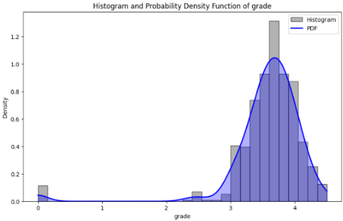
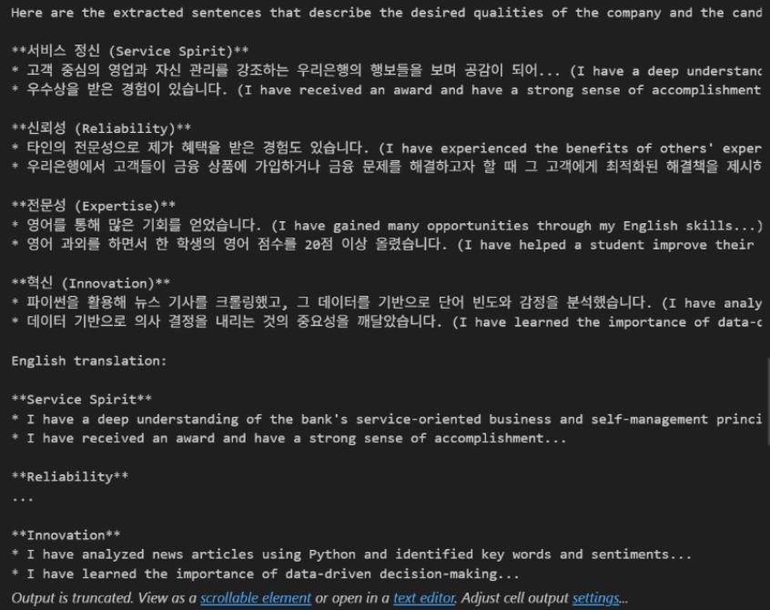

# 너 자신을 알라, project1

## 📗 목차

1. [📝 배경](#📝-1.-배경)
2. [📚 문제정의](#📚-2.-문제정의)
3. [📃 사용 데이터](#📃-3.-사용-데이터)
4. [📊 데이터 전처리](#📊-4.-데이터-전처리)
5. [🤖 AI 모델 개발](#🤖-5.-AI-모델-개발)
6. [💡 결론](#💡-6.-결론)

## **📝 1. 배경**
주변에 취업에 대한 고민을 하는 사람이 많아짐에 따라,  
원하는 기업에 취업하기 위해서 <b>어떤 스펙</b>을 갖춰야 하고,  
<b>자소서 작성 방향</b>에 대한 정의가 어려워 프로젝트 시작

## **📚 2. 문제정의**
취준생의 스펙(<u>TOEIC, 학점, 해외경험횟수</u> 등)을 목표 기업 합격자와 비교시 
<b>취준생의 스펙의 어떤 부분을 보완</b>해야 할지,  
자소서에는 <b>해당 기업의 인재상</b>을 포함해서 어떤식으로 쓰면 좋을지를 알려주고자 함.

## **📃 3. 사용 데이터**
[1] [합격자의 스펙 데이터](https://www.jobkorea.co.kr/company/1836350/PassAvgSpec?companyIdx=5056&Tab=3&Page=1) 
[2] [합격 자소서](https://www.jobkorea.co.kr/company/1836350/PassAssay)

## **📊 4. 데이터 전처리**
- 결측치 0(수치형)처리 
- 수치형 및 범주형으로 변환 
- 이산형 분포를 연속형 분포로 변환하여 데이터 샘플링 및 증강(KDE 이용)

## **🤖 5. AI 모델 개발**
(1) <b>스펙 지수</b> 예측

    1) NN
     - 스펙에 대한 스펙지수 예측 모델

    2) polynomial
     - 각 스펙의 n년후 수치 예측 모델

(2) <b>Groq API</b>로 자소서에서 인재상 관련 문장 추출 
▽결과 화면

(3) 모델 결과

    1) NN R-squared : 0.99 [간단 스펙지수 계산 알고리즘이기에 높은 결정계수 도출]

(4) 제한점 및 개선 방안
    
    1) 크롤링 데이터 부족 → 다양한 기업/산업군 데이터 추가 수집
    2) Groq API 문맥 분석 정확도 한계 → <b>BERT</b> 등 자연어 처리 모델 추가 활용  

## **💡 6. 결론**
- 합격자 평균 스펙과 비교하여 취준생의 <b>부족한 스펙 요소</b> 제시로 <b>효율적 스펙 준비</b>
- 자소서 내 인재상 관련 문장 제안으로 <b>효과적 자소서 작성</b> 지원
- 스펙 변화 예측으로 취준생 <b>미래 목표 및 방향성</b> 설정

    

# B-Is-Able, project2

## 📗 목차

1. [📝 배경](#📝-1.-배경)
2. [📚 문제정의](#📚-2.-문제정의)
3. [📃 사용 데이터](#📃-3.-사용-데이터)
4. [📊 데이터 전처리](#📊-4.-데이터-전처리)
5. [🤖 AI 모델 개발](#🤖-5.-AI-모델-개발)
6. [💡 결론](#💡-6.-결론)

## **📝 1. 배경**
시각장애인이 운동을 할 때,  
"삐뚤어진 것을 눈으로 직접 확인할 수 없어 불편하다" - 원샷한솔 Youtube  "시각장애인 맞춤형 건강관리/운동 프로그램이 전무하다" - 에이블뉴스  
이렇게 나타나는 불편함을 개선하기 위해 프로젝트 시작 

## **📚 2. 문제정의**
-	일반인들은 운동 중 자신의 자세를 거울을 통해 확인하고, 이를 바탕으로 자세를 수정하며 안전하게 운동 가능
-	시각장애인의 경우 자신의 자세 직접 확인이 어려워 잘못된 자세 지속 가능성 증가, 운동 효율 감소 및 근육 불균형, 부상 발생 확률 증가의 원인
-	운동 자세는 시간에 따른 동작 변화 필요, 시각적 인식 및 교정 필수 
-	시각장애인을 대상 문제를 해결 방법으로 실시간 자세를 분석, 올바른 자세 유지를 위한 효과적인 피드백 제공 시스템 필요

## **📃 3. 사용 데이터**

## **📊 4. 데이터 전처리**

## **🤖 5. AI 모델 개발**

## **💡 6. 결론**
